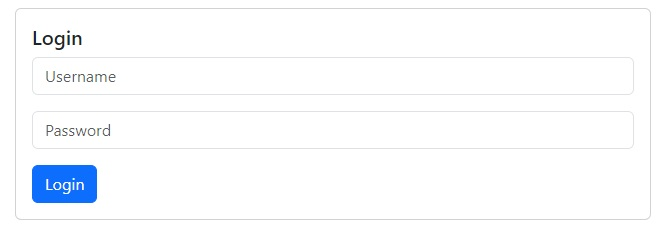
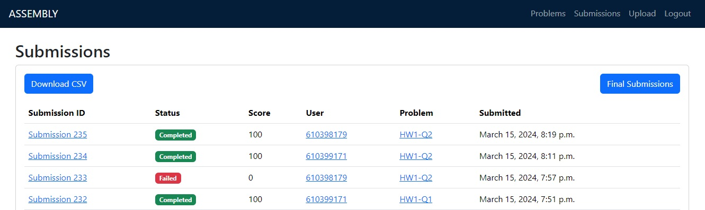

 Django NASM Judger
===
Abstract: The Django NASM Judger is a web application designed to assist teachers and students in evaluating assembly language programming assignments written in NASM. Developed as a tool for teaching assistants, this platform allows instructors to effortlessly create programming challenges, provide input data, and specify expected outputs. Students can then submit their NASM code solutions, which are automatically compiled, executed, and evaluated against the provided test cases. The system calculates scores based on the accuracy of the output produced by the student's code, providing instant feedback and assessment. With a user-friendly interface and robust backend functionality, the Django NASM Judger streamlines the process of grading assembly language assignments, enhancing the efficiency and effectiveness of programming education.

<div align="center">
    
</div>

## Install & Dependence

To use the Django NASM Judger website, follow these steps:

 **Python Installation:**
   Ensure that Python is installed on your system. If not, download and install it from [python.org](https://www.python.org/).

 **Create a Virtual Environment:**
   Create a virtual environment using the following command:
   ```
   python -m venv env
   ```

 **Activate the Virtual Environment:**
   Activate the virtual environment. On Unix or MacOS, use:
   ```
   source env/bin/activate
   ```
   On Windows, use:
   ```
   .\env\Scripts\activate
   ```

 **Install Required Libraries:**
   Install necessary libraries including Django, Celery, and python-dotenv using:
   ```
   pip install -r requirements.txt
   ```

 **Initialize Server and Create Superuser:**
   Run the following commands to initialize the project and create a superuser:
   ```
   python manage.py shell
   ```
   Then, inside the shell:
   ```python
   from reset import run
   run()
   ```
   This will initialize the project and create a superuser with the username `admin` and password `password`.

 **Run the Server:**
   Start the Django server using:
   ```
   python manage.py runserver
   ```

 **Access the Website:**
   Open a web browser and go to [127.0.0.1:8000](http://127.0.0.1:8000) to access the Django NASM Judger website.

---

Feel free to adjust the instructions as needed based on your project's specific requirements and configurations.

## Login

**User Roles:**

1. **Staffs:**
   - Staff members have administrative privileges.
   - They can upload problems and view results for all submissions.
   - Staffs have access to administrative features and data across the platform.

2. **Students:**
   - Students have limited access compared to staff members.
   - They can only upload their submissions to the problems and view their own results.
   - Students are restricted from accessing administrative features and data meant for staff members.

**Admin Page:**

- The admin page provides administrative functionality for managing users and their roles.
- Admin users can add new users and assign them roles (staff or student) using the provided interface.
- This allows for easy management and control over user access and privileges within the system.
<div align="center">
    
</div>

---

## Upload Problems

Staff members have the capability to upload programming problems to the platform. This includes setting the title and description of the problem, defining a time limit for submissions in seconds, and providing input-output test cases packaged in a zip file, similar to the format used on platforms like Codeforces. Additionally, staff members can choose whether users are allowed to submit solutions to the problem or not. This functionality empowers staff to efficiently manage and administer the problem-solving environment, ensuring a structured and controlled learning experience for students.
Users can view a list of problems and check whether they can submit solutions for each problem.

<div align="center">
    
</div>

## Submit Solutions

Within the platform, users have the capability to not only view their submissions for each problem but also submit their solutions in the form of ".asm" files. This feature facilitates an interactive learning experience, allowing users to track their progress, review previous submissions, and continuously improve their assembly language programming skills by actively engaging with the provided problem sets.

<div align="center">
    
</div>

## View Submission Results

Users are provided with comprehensive feedback on their submissions within the platform. They can not only access their submitted code but also view their scores based on the test cases applied to their solution. Each test case result is displayed individually, allowing users to assess the correctness of their code for each specific scenario. Moreover, to ensure efficient processing of submissions, the server utilizes Celery to create a queue for compiling and reviewing submissions. Submissions can be in different states such as queue, testing, failed, or completed, reflecting the progress of the evaluation process. This combination of detailed feedback and efficient processing enhances the learning experience, enabling users to iteratively refine their assembly language programming skills.


## Submission Overview and Reporting:

Users have the flexibility to access their submissions for specific problems or view all of their submissions across the platform. Additionally, users can generate comprehensive reports in CSV format, providing a detailed overview of their submissions, scores, and performance metrics. Moreover, users are empowered to click on "final submission" to see just the final submission for each user in each problem. They can then click it again to revert to the previous state and view all submissions. On the other hand, staff members possess broader access privileges, allowing them to view the results of all students collectively or filter by specific users, problems, or criteria. This robust reporting functionality empowers both users and staff to track progress, identify areas for improvement, and facilitate data-driven decision-making within the educational context.

<div align="center">
    
</div>
